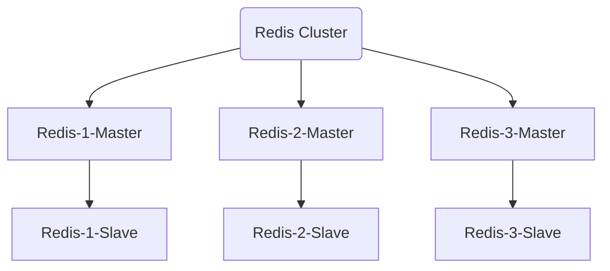

* 目录
  {:toc}

## 简介

**特点**

- 没有中心节点，客户端可与任一节点直接连接，不需要中间代理层
- 数据可以分片存储
- 节点管理方便，可以增加或删除节点


**主从同步**

- 因为采用分片存储，所以每个主节点存储的数据都是不相同的。

- 如果某个主节点挂掉，数据就会丢失，所以要引入从节点。

- Redis 集群中应包含奇数个主节点，至少应该有**3**个。

> Redis Cluster 集群和 PXC 集群都有选举的机制，也就是说当节点内超过一半的节点挂掉后，剩余节点就无法进行选举组成新的集群。
>
> 假如是两个主节点组成的集群，一个挂掉后，另一个就无法组成集群。


**流程图**

因为 Github 的 markdown 语法不支持流程图，所以生成了图片贴上来。




***
## 部署

因为没那么多实体机器，配置多台虚拟机又相当麻烦，这里在 **CentOS 7** 下采用 **Docker** 环境来部署测试。

首先创建一台 CentOS 7 虚拟机，做好准备工作。
##### 换阿里源
```
yum install -y wget
mv /etc/yum.repos.d/CentOS-Base.repo /etc/yum.repos.d/CentOS-Base.repo.backup
wget -O /etc/yum.repos.d/CentOS-Base.repo http://mirrors.aliyun.com/repo/Centos-7.repo
yum makecache
```

##### 安装 Docker 并启动
```
yum install -y docker
service docker start
```

##### 下载镜像并更名
```
docker pull yyyyttttwwww/redis
docker tag docker.io/yyyyttttwwww/redis redis
docker rmi docker.io/yyyyttttwwww/redis
```

##### 创建网段
```
docker network create --subnet=172.19.0.0/16 net1
```

##### 创建容器
```
docker run -it -d --name r1 -p 5001:6379 --net=net1 --ip 172.19.0.2 redis bash
docker run -it -d --name r2 -p 5002:6379 --net=net1 --ip 172.19.0.3 redis bash
docker run -it -d --name r3 -p 5003:6379 --net=net1 --ip 172.19.0.4 redis bash
docker run -it -d --name r4 -p 5004:6379 --net=net1 --ip 172.19.0.5 redis bash
docker run -it -d --name r5 -p 5005:6379 --net=net1 --ip 172.19.0.6 redis bash
docker run -it -d --name r6 -p 5006:6379 --net=net1 --ip 172.19.0.7 redis bash
```

##### 启动容器修改配置文件

下面以第一个容器为例，要把创建的所有容器都进行修改。

```
docker exec -it r1 bash
vi /usr/redis/redis.conf
# 修改以下参数并保存，vi内可以在非编辑模式下通过 /关键字 进行搜索
daemonize yes #以后台进程运行
cluster-enabled yes #开启集群
cluster-config-file nodes.conf #集群配置文件
cluster-node-timeout 15000 #超时时间
appendonly yes #开启AOF模式

# 启动服务
/usr/redis/src/redis-server /usr/redis/redis.conf

```
##### 安装redis-trib.rb

```
yum install ruby
yum install -y rubygems
gem install redis
```

##### 启动集群

进入任一节点，执行以下命令

```
/usr/redis/src/redis-trib.rb create --replicas 1 172.19.0.2:6379 172.19.0.3:6379 172.19.0.4:6379 172.19.0.5:6379 172.19.0.6:6379 172.19.0.7:6379
```

***

## 结束

上面是以 Docker 来进行演示的，实体机部署时原理都是一样的，如果碰到问题，多 Google 一下。

