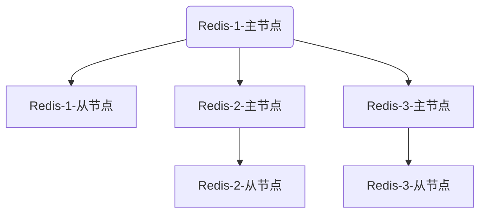

## Redis Cluster 简介

- 没有中心节点，客户端可与任一节点直接连接，不需要中间代理层

- 数据可以分片存储

- 节点管理方便，可以增加或删除节点

  

**流程图**

``` mermaid
graph TD
A(Redis-1-主节点)
A --> B[Redis-1-从节点]
A --> C[Redis-2-主节点]
A --> D[Redis-3-主节点]
C --> E[Redis-2-从节点]
D --> F[Redis-3-从节点]
```

