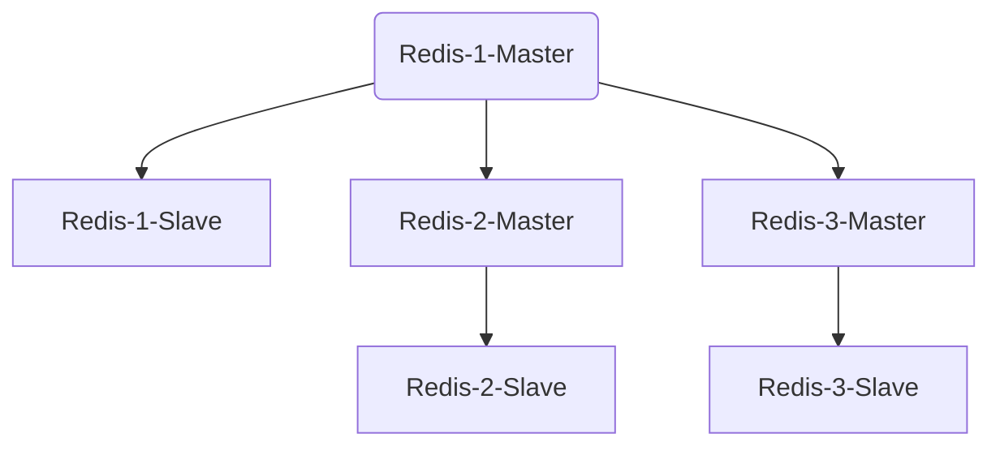

## Redis Cluster 简介

**特点**

- 没有中心节点，客户端可与任一节点直接连接，不需要中间代理层
- 数据可以分片存储
- 节点管理方便，可以增加或删除节点

**主从同步**

因为采用分片存储，所以每个主节点存储的数据都是不相同的。

如果某个主节点挂掉，数据就会丢失，所以要引入从节点。

**高可用**

- Redis 集群中应包含奇数个主节点，至少应该有**3**个。

> Redis Cluster 集群和 PXC 集群都有选举的机制，也就是说当节点内超过一半的节点挂掉后，剩余节点就无法进行选举组成新的集群。
>
> 假如是两个主节点组成的集群，一个挂掉后，另一个就无法组成集群。

**流程图**

``` mermaid
graph TD
	A(Redis-1-Master)
	A --> B[Redis-1-Slave]
	A --> C[Redis-2-Master]
	A --> D[Redis-3-Master]
	C --> E[Redis-2-Slave]
	D --> F[Redis-3-Slave]
```

